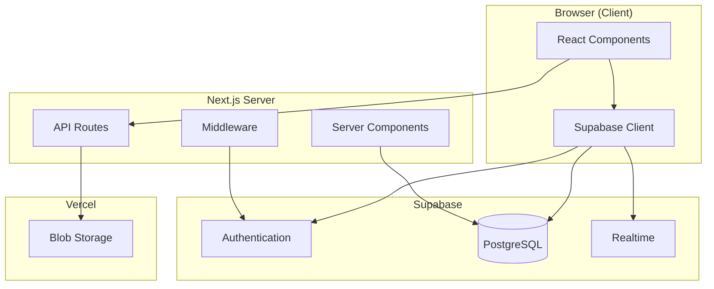
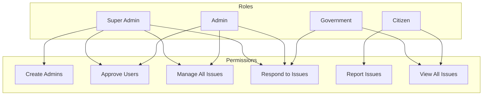
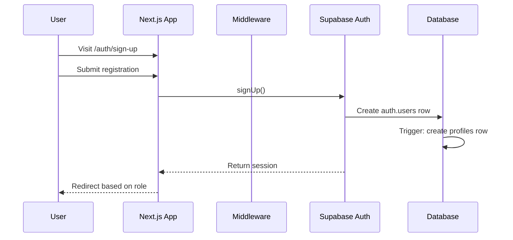
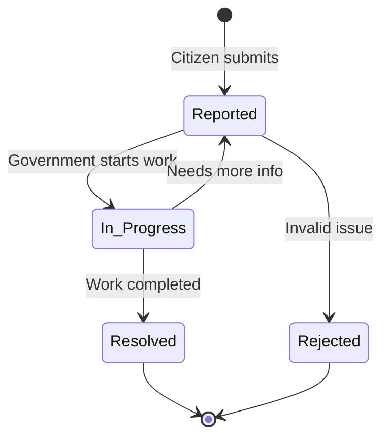

# Samadhan - Project Architecture

Overview of the project structure, components, and data flow.

---

## Tech Stack

| Layer | Technology |
|-------|-----------|
| **Frontend** | Next.js 14 (App Router), React 18, TypeScript |
| **Styling** | Tailwind CSS, shadcn/ui components |
| **Database** | Supabase (PostgreSQL) |
| **Auth** | Supabase Auth (JWT) |
| **File Storage** | Vercel Blob |
| **Hosting** | Vercel |

---

## Folder Structure

```
samadhan/
├── app/                    # Next.js App Router pages
│   ├── admin/              # Admin dashboard
│   │   └── page.tsx        # Admin UI (2000+ lines)
│   ├── api/                # API routes
│   │   └── upload/         # File upload endpoint
│   ├── auth/               # Authentication pages
│   │   ├── login/          # Login page
│   │   ├── logout/         # Logout handler
│   │   ├── sign-up/        # Registration
│   │   └── sign-up-success/# Post-registration
│   ├── dashboard/          # Government dashboard
│   ├── report/             # Citizen issue reporting
│   ├── globals.css         # Tailwind configuration
│   ├── layout.tsx          # Root layout
│   └── page.tsx            # Homepage
│
├── components/             # React components
│   ├── ui/                 # shadcn/ui components
│   ├── admin/              # Admin dashboard components
│   │   ├── admin-nav.tsx
│   │   ├── admin-overview.tsx
│   │   ├── admin-users.tsx
│   │   ├── admin-issues.tsx
│   │   ├── admin-analytics.tsx
│   │   └── admin-types.ts
│   ├── dashboard-stats.tsx # Statistics cards
│   ├── report-form.tsx     # Issue reporting
│   ├── issues-list.tsx     # Issues table (with modal)
│   ├── location-verification.tsx # GPS verification
│   ├── notification-*.tsx  # Notification system
│   └── recent-issues.tsx   # Issues feed
│
├── lib/                    # Utilities and clients
│   ├── supabase/           # Supabase configuration
│   │   ├── client.ts       # Browser client
│   │   ├── server.ts       # Server client
│   │   └── middleware.ts   # Auth middleware
│   ├── geolocation.ts      # GPS utilities
│   └── utils.ts            # Helper functions
│
├── scripts/                # Database scripts
│   └── db.sql              # Complete schema
│
├── docs/                   # Documentation
│   ├── SETUP.md            # Setup guide
│   ├── API.md              # API reference
│   └── ARCHITECTURE.md     # This file
│
├── middleware.ts           # Next.js middleware
├── .env.example            # Environment template
└── package.json            # Dependencies
```

---

## Data Flow



---

## User Roles & Permissions



---

## Authentication Flow



---

## Issue Lifecycle



---

## Key Components

### Authentication (`lib/supabase/`)

- **client.ts**: Browser-side Supabase client for client components
- **server.ts**: Server-side client for server components/API routes
- **middleware.ts**: Session management and route protection

### Issue Reporting (`components/report-form.tsx`)

1. Captures issue details (title, description, category)
2. Gets GPS coordinates via browser geolocation
3. Uploads photo to Vercel Blob
4. Creates issue record in Supabase

### Issue Response (`components/issues-list.tsx` / `admin-issues.tsx`)

1. Government user views issue details
2. Verifies their location matches issue location
3. Uploads resolution photo
4. Calls `add_issue_response` RPC function

### Admin Dashboard (`app/admin/page.tsx`)

Acts as a coordinator ("smart container") that:
- Handles authentication and initial data fetching.
- Manages global state (tabs, user session).
- Renders modular child components:
  - `AdminNav`: Navigation and notifications.
  - `AdminOverview`: High-level stats and widgets.
  - `AdminUsers`: User approvals and management.
  - `AdminIssues`: Issue tracking and resolution.
  - `AnalyticsContent`: Charts and data visualization.

---

## Security Features

| Feature | Implementation |
|---------|---------------|
| **Row Level Security** | All tables have RLS policies |
| **Role-based Access** | Enforced at database level |
| **Location Verification** | GPS matching for responses |
| **Approval Workflow** | Government users need admin approval |
| **Audit Logging** | Admin actions tracked in `admin_actions` |

---

## Environment Variables

| Variable | Required | Description |
|----------|----------|-------------|
| `NEXT_PUBLIC_SUPABASE_URL` | Yes | Supabase project URL |
| `NEXT_PUBLIC_SUPABASE_ANON_KEY` | Yes | Public API key |
| `SUPABASE_SERVICE_ROLE_KEY` | Yes | Server-side admin key |
| `BLOB_READ_WRITE_TOKEN` | Yes* | Vercel Blob token |
| `NEXT_PUBLIC_SITE_URL` | Yes | Site URL for auth redirects |
| `NEXT_PUBLIC_DEV_SUPABASE_REDIRECT_URL` | Yes | Dev redirect URL |

*Required for photo uploads
